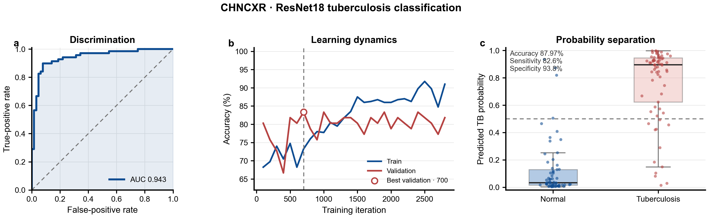
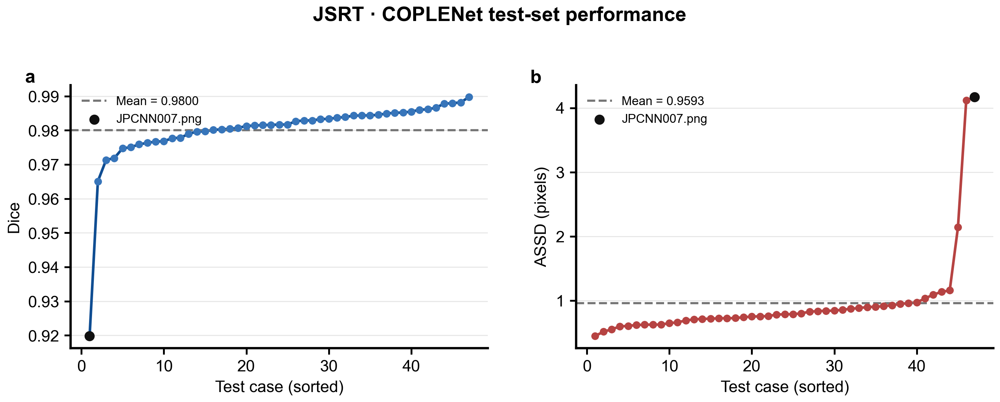
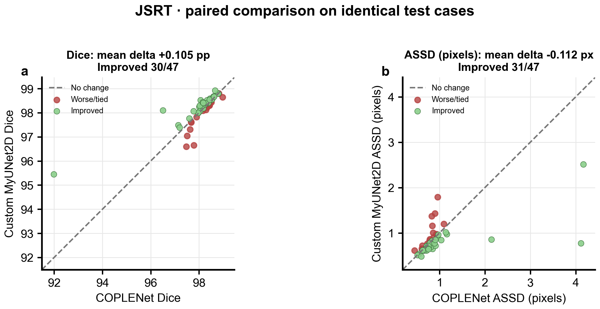
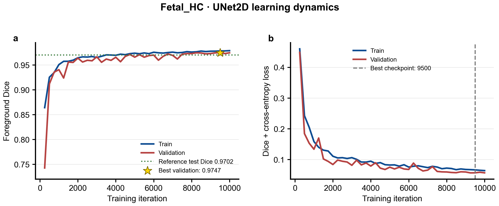

# PyMIC Example Reproduction

这个仓库记录我对 [PyMIC](https://github.com/HiLab-git/PyMIC) 官方示例的复现过程，重点保存可重复执行的配置、终端命令、实验日志、评价结果和对比图。

> 本仓库是个人学习与复现记录，不是 PyMIC 官方仓库。原始代码和示例分别来自 [HiLab-git/PyMIC](https://github.com/HiLab-git/PyMIC) 与 [HiLab-git/PyMIC_examples](https://github.com/HiLab-git/PyMIC_examples)。

## 已完成实验

| Example | Task | Device | Status | Primary result | Secondary result |
|---|---|---|---|---:|---:|
| [AntBee](experiments/antbee/README.md) | ResNet18 二分类迁移学习 | Apple MPS | 完成 | Accuracy 94.77% | AUC 97.90% |
| [CHNCXR](experiments/chncxr/README.md) | ResNet18 胸片正常/结核分类 | NVIDIA CUDA | 完成 | Accuracy 87.97% | AUC 94.34% |
| [JSRT COPLENet](experiments/jsrt_coplenet/README.md) | 胸片肺野二维全监督分割 | NVIDIA CUDA | 完成 | Dice 98.00% | ASSD 0.959 px |
| [JSRT Custom](experiments/jsrt_custom/README.md) | 自定义残差 UNet 与组合 loss | NVIDIA CUDA | 完成 | Dice 98.11% | ASSD 0.847 px |
| [Fetal_HC UNet](experiments/fetal_hc_unet/README.md) | 胎儿超声头部二维分割 | NVIDIA CUDA | 完成 | Dice 97.09% | ASSD 5.207 px |

AntBee 分别比较了两种迁移学习策略：

- CE1：微调 ResNet18 全部参数。
- CE2：冻结骨干网络，只微调最后的分类层。


CHNCXR 使用 662 张深圳医院胸片，在独立测试集上取得 87.97% accuracy 和 94.34% AUC。



JSRT COPLENet 在 47 例独立测试集上取得 98.00% Dice，与示例参考结果 98.04% 基本一致。



JSRT Custom 展示了如何向 PyMIC 注册自定义网络和 loss，在相同测试集上取得 98.11% Dice 和 0.847 pixels ASSD。



Fetal_HC UNet 在 149 例测试集上取得 97.09% Dice，并记录了完整学习曲线和逐病例误差分析。



## 仓库结构

```text
Pymic_example/
├── experiments/
│   ├── antbee/
│   ├── chncxr/
│   ├── fetal_hc_unet/
│   ├── jsrt_coplenet/
│   └── jsrt_custom/
│       ├── config/       # 训练与评价配置
│       ├── figures/      # 实验图表及绘图脚本
│       ├── logs/         # 完整训练日志
│       ├── results/      # 预测概率和指标汇总
│       ├── scripts/      # 数据清单与 ROC 脚本
│       └── README.md     # 逐步复现记录
├── patches/              # Apple Silicon / MPS 兼容补丁
├── requirements.txt      # 本次验证的主要环境版本
└── README.md
```

## 复现环境

| Example | OS | Python | PyTorch | Accelerator |
|---|---|---|---|---|
| AntBee | macOS | 3.13.9 | 2.11.0 | Apple MPS |
| CHNCXR | Windows 11 | 3.10.19 | 2.10.0+cu130 | NVIDIA CUDA |
| JSRT COPLENet | Windows 11 | 3.10.19 | 2.10.0+cu130 | NVIDIA CUDA |
| JSRT Custom | Windows 11 | 3.10.19 | 2.10.0+cu130 | NVIDIA CUDA |
| Fetal_HC UNet | Windows 11 | 3.10.19 | 2.10.0+cu130 | NVIDIA CUDA |

```bash
python -c "import torch; print('CUDA:', torch.cuda.is_available()); print('MPS:', torch.backends.mps.is_available())"
```

详细命令和实验说明见各 example 的独立 README。

## 数据与模型文件

数据集和训练 checkpoint 不提交到 Git：

- Hymenoptera 数据集请从 PyTorch 官方地址下载。
- CHNCXR 数据来自 Shenzhen Hospital X-ray Set，按 PyMIC 官方示例目录放置。
- JSRT 图像与肺野标注按 PyMIC 官方示例目录放置。
- Fetal_HC 使用 HC18 胎儿头部超声图像及二值分割标注。
- ResNet18 预训练权重由 torchvision 自动下载。
- 本地训练 checkpoint 通过 `.gitignore` 排除，避免仓库体积过大。

## 当前限制

- AntBee 使用官方示例中的验证集作为测试输入，并非独立测试集；CHNCXR 使用独立测试划分。
- 每种设置只运行了一次，尚未进行多随机种子统计。
- 当前已验证 PyMIC 分类和二维全监督分割流程；半监督、弱监督及噪声标签学习等模式仍需继续验证。
