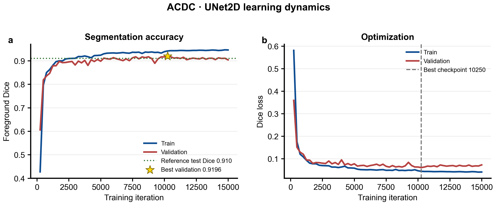
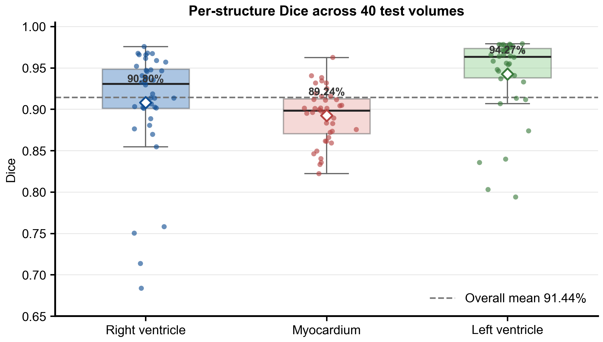
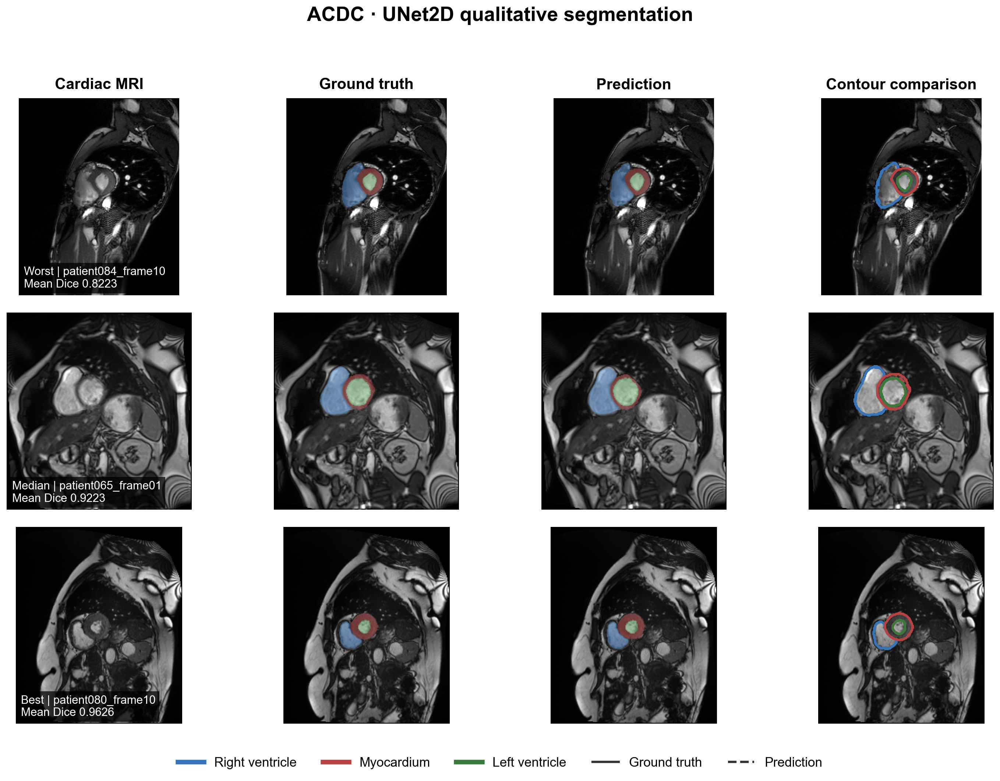

# ACDC UNet2D 心脏 MRI 分割复现

本实验复现 PyMIC `seg_full_sup/2d_ACDC` 的 UNet2D 基线，在 ACDC 短轴心脏电影 MRI 上分割右心室（RV）、心肌（Myo）和左心室（LV）。训练、测试和评价均在 Windows 11 + NVIDIA CUDA 环境中完成。

## 技术简介

UNet2D 使用编码器提取多尺度图像特征，再由解码器恢复空间分辨率；同尺度跳跃连接将浅层定位信息传递给解码端。虽然输入数据是三维 MRI 体积，网络会把每个包含 8 个切片的子体积按二维切片处理，并在测试时通过滑动窗口重建完整体积。

Dice 衡量预测结构与人工标注的区域重叠，越接近 1 越好。本实验分别报告 RV、Myo 和 LV 的 Dice，并以三类均值作为每个病例的总体指标。

## 实验结果

| 指标 | 结果 |
|---|---:|
| 参数量 | 1,813,252 |
| 最佳 checkpoint | iteration 10250 |
| 最佳验证 Dice | 91.9629% |
| 测试 RV Dice | 90.8010% ± 6.8024% |
| 测试 Myo Dice | 89.2430% ± 3.2468% |
| 测试 LV Dice | 94.2705% ± 4.7839% |
| 测试三类平均 Dice | 91.4382% ± 3.5199% |
| 单体积推理时间 | 0.1030 ± 0.0412 seconds |
| 训练耗时 | 约 67 分 37 秒 |

官方示例给出的平均 Dice 参考值约为 91.00%。本次结果高约 0.44 个百分点，处于正常复现波动范围，不需要为这一差异额外调参。







## 数据划分

使用 ACDC 数据集 100 名受试者的 200 个标注心动周期体积，并按受试者级别划分：

- 训练集：140 个体积
- 验证集：20 个体积
- 测试集：40 个体积

预处理图像放在仓库根目录的 `PyMIC_data/ACDC/preprocess`，不提交到 Git。`config/data/` 保存本次实际使用的数据清单。

## 环境与配置

本次环境为 Python 3.10.19、PyMIC 0.5.4、PyTorch 2.10.0+cu130、torchvision 0.25.0+cu130 和 NVIDIA GeForce RTX 5060 Laptop GPU。

主要训练设置：

- 网络：UNet2D，四分类输出。
- patch：8 × 224 × 224；batch size 4。
- 数据增强：归一化、padding、随机翻转、前景聚焦随机裁剪。
- 损失：Dice loss；优化器：Adam，初始学习率 0.001。
- 训练 15000 iterations，每 250 iterations 验证；每 5000 iterations 学习率减半。

## 训练、测试与评价

在原始示例目录 `PyMIC_examples/seg_full_sup/2d_ACDC` 中执行。SimpleITK 会对部分 NIfTI 标签报告 `unexpected scales in sform`，文件仍可正确读取；下面通过进程级设置隐藏重复 warning，不修改图像头。

```powershell
conda activate med_ai_310
python -c "import sys, SimpleITK as sitk; sitk.ProcessObject_SetGlobalWarningDisplay(False); sys.argv=['pymic_train','config/unet.cfg']; from pymic.net_run.train import main; main()"
```

测试可信的本地 checkpoint 时：

```powershell
$env:TORCH_FORCE_NO_WEIGHTS_ONLY_LOAD='1'
python -c "import sys, SimpleITK as sitk; sitk.ProcessObject_SetGlobalWarningDisplay(False); sys.argv=['pymic_test','config/unet.cfg']; from pymic.net_run.predict import main; main()"
python -c "import sys, SimpleITK as sitk; sitk.ProcessObject_SetGlobalWarningDisplay(False); sys.argv=['pymic_eval_seg','--cfg','config/evaluation.cfg']; from pymic.util.evaluation_seg import main; main()"
Remove-Item Env:TORCH_FORCE_NO_WEIGHTS_ONLY_LOAD
```

`TORCH_FORCE_NO_WEIGHTS_ONLY_LOAD` 只应用于来源明确、可信的本机 checkpoint，不用于未知下载文件。

## 重新绘图

脚本按照 figures4papers 风格输出 300 DPI PNG 和可编辑 PDF：

```powershell
python scripts/plot_results.py --data-root D:\Hi_Lab\PyMIC_examples\PyMIC_data\ACDC\preprocess
```

## 文件说明

- `config/`：训练、测试、评价配置与数据划分。
- `logs/`：完整训练和测试日志。
- `results/`：逐病例 Dice、汇总指标和 40 个预测分割体积。
- `scripts/plot_results.py`：学习曲线、结构级分布和定性结果绘图脚本。
- `figures/`：PNG/PDF 论文风格图。

## 局限性

- 当前只运行一个随机种子，不能据此比较网络间的统计显著性。
- 结果仅来自 UNet2D；官方示例中的 UNet_ScSE、CANet、COPLENet、UNet++ 和 Transformer 系列尚未比较。
- ACDC 每名受试者包含两个心动周期体积，数据划分必须保持受试者级隔离。
