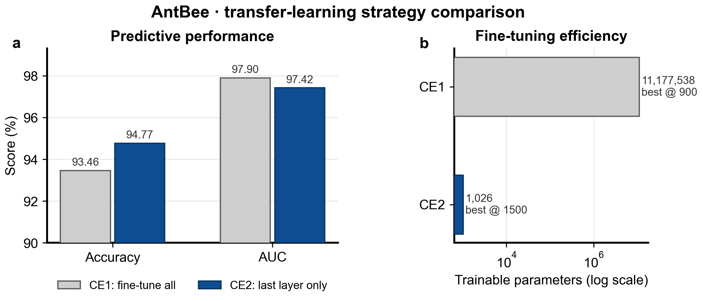

# AntBee 分类复现

## 1. 实验目标

使用 ImageNet 预训练的 ResNet18 区分蚂蚁和蜜蜂，并比较两种微调策略：

- **CE1 / `update_mode = all`**：更新全部网络参数。
- **CE2 / `update_mode = last`**：冻结骨干网络，只更新最后的分类层。

原始示例来自 [PyMIC_examples/classification/AntBee](https://github.com/HiLab-git/PyMIC_examples/tree/main/classification/AntBee)，数据来自 PyTorch 的迁移学习教程。

## 技术简介

迁移学习先复用 ResNet18 在 ImageNet 上学到的通用视觉特征，再用较小的蚂蚁/蜜蜂数据集完成二分类。CE1 会更新整个网络，适应能力更强但需要训练约 1118 万个参数；CE2 冻结卷积骨干，只训练最后的线性分类器，因此计算和存储开销更低，也更不容易在小数据集上过拟合。

Accuracy 衡量最终分类正确率，AUC 则汇总不同判定阈值下区分两类样本的能力。两者结合可以避免只根据单一阈值评价模型。

## 2. 数据集

下载并解压：

```bash
cd experiments/antbee
curl -LO https://download.pytorch.org/tutorial/hymenoptera_data.zip
mkdir -p ../../data
unzip hymenoptera_data.zip -d ../../data
```

本次实际读取的数据：

| Split | Ants | Bees | Total |
|---|---:|---:|---:|
| Train | 122 | 121 | 243 |
| Validation | 70 | 83 | 153 |

生成 CSV 清单：

```bash
python scripts/write_csv_files.py
```

如果数据目录和本记录不同，需要调整 `config/train_test_ce1.cfg` 和 `config/train_test_ce2.cfg` 中的 `root_dir`。

## 3. Apple MPS 环境

确认 MPS 可用：

```bash
python -c "import torch; print(torch.backends.mps.is_available()); print(torch.tensor([1.0], device='mps'))"
```

本次输出：

```text
True
tensor([1.], device='mps:0')
```

本次使用的 PyMIC 源码需要应用仓库中的 MPS 兼容补丁：

```bash
git clone https://github.com/HiLab-git/PyMIC.git
git -C PyMIC apply /path/to/Pymic_example/patches/pymic-macos-mps.patch
python -m pip install --no-deps -e ./PyMIC
```

补丁包含自动选择 CUDA/MPS/CPU、避免 MPS `float64`、延迟加载可选任务依赖、解析空 GPU 列表以及兼容评价 CLI 等修改。

## 4. 训练

CE1，全参数微调：

```bash
pymic_train config/train_test_ce1.cfg
```

CE2，只微调最后一层：

```bash
pymic_train config/train_test_ce2.cfg
```

共同设置：

- 输入：RGB，224 × 224。
- 增强：先缩放至 256 × 256，再随机裁剪和水平翻转。
- 验证：中心裁剪。
- 归一化：ImageNet mean/std。
- 优化器：SGD，初始学习率 0.001。
- 学习率：每 500 iteration 乘以 0.5。
- 最大迭代：2000；每 100 iteration 验证。
- Batch size：4。

## 5. 测试与评价

```bash
pymic_test config/train_test_ce1.cfg
pymic_eval_cls --cfg config/evaluation_ce1.cfg

pymic_test config/train_test_ce2.cfg
pymic_eval_cls --cfg config/evaluation_ce2.cfg
```

## 6. 实验结果

| Experiment | Update mode | Trainable parameters | Best iteration | Accuracy | AUC | Wall time | Checkpoint |
|---|---|---:|---:|---:|---:|---:|---:|
| CE1 | All layers | 11,177,538 | 900 | 93.46% | **97.90%** | 42m 27s | 85 MB |
| CE2 | Last layer | **1,026** | 1500 | **94.77%** | 97.42% | 39m 25s | 43 MB |



CE2 的 accuracy 高约 1.31 个百分点，在 153 张验证图片上相当于多正确分类约 2 张；CE1 的 AUC 高约 0.48 个百分点。CE2 只更新约 0.0092% 的参数，更新参数量减少约 10,894 倍。

本实验中 CE2 更适合作为高效默认方案，但现有结果不足以证明它普遍优于 CE1：验证集同时被用作 `test_csv`，且没有多随机种子实验。

## 7. 生成对比图

```bash
python figures/gen_fig_ce1_ce2_comparison.py
```

脚本同时生成 300 DPI PNG 和矢量 PDF。

## 8. 遇到的问题

1. PyMIC 原分类 agent 默认构造 CUDA device，Apple Silicon 无法直接运行。
2. MPS 不支持训练统计代码中的 `float64` tensor。
3. 空列表 `gpus = []` 无法被原配置解析器正确处理。
4. 分类命令启动时会提前导入分割相关可选依赖。
5. `imops` 在当前 Apple clang 环境中因 OpenMP 编译失败，但相关导入实际未使用。
6. 评价脚本与文档使用的 `-cfg`/`--cfg` 参数存在不一致。

这些问题的对应修改保存在 [`patches/pymic-macos-mps.patch`](../../patches/pymic-macos-mps.patch)。
