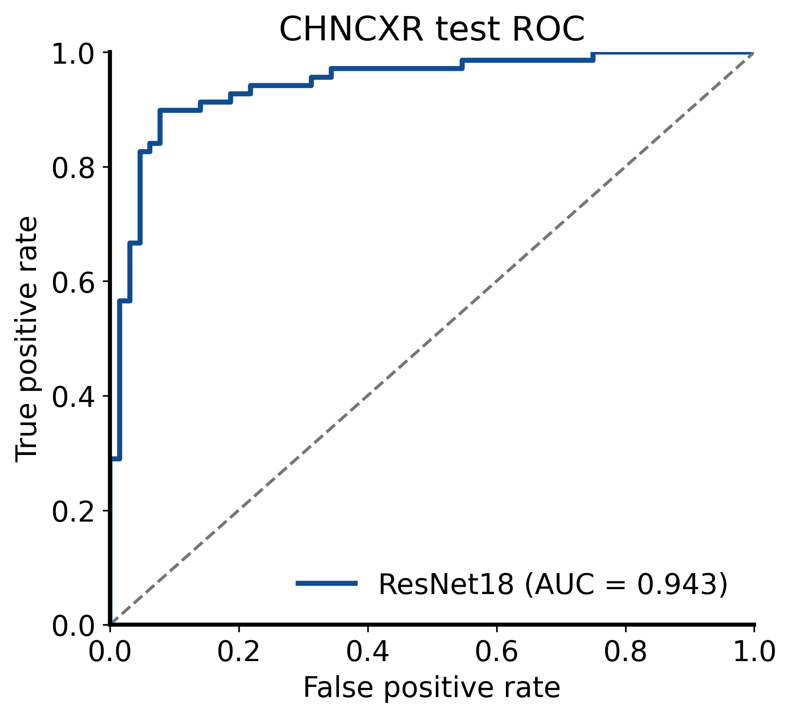

# CHNCXR 胸片分类复现

## 1. 实验目标

使用 ImageNet 预训练的 ResNet18 区分正常胸片与结核异常胸片。原始示例来自 [PyMIC_examples/classification/CHNCXR](https://github.com/HiLab-git/PyMIC_examples/tree/main/classification/CHNCXR)，数据为 Shenzhen Hospital X-ray Set。

## 2. 数据集

PyMIC 官方数据包解压后，将 `CHNCXR/CXR_png` 放在仓库根目录的 `PyMIC_data` 下：

```text
Pymic_example/
├── PyMIC_data/
│   └── CHNCXR/
│       └── CXR_png/
└── experiments/
    └── chncxr/
```

本次使用官方仓库提供的固定 CSV 划分：

| Split | Normal | Tuberculosis | Total |
|---|---:|---:|---:|
| Train | 235 | 228 | 463 |
| Validation | 27 | 39 | 66 |
| Test | 64 | 69 | 133 |

数据集和 checkpoint 不提交到 Git。

## 3. 验证环境

- Windows 11
- Python 3.10.19
- PyMIC 0.5.4
- PyTorch 2.10.0+cu130
- torchvision 0.25.0+cu130
- NVIDIA GeForce RTX 5060 Laptop GPU

```powershell
conda activate med_ai_310
python -c "import torch; print(torch.cuda.is_available()); print(torch.cuda.get_device_name(0))"
```

## 4. 训练配置

- 模型：ImageNet 预训练 ResNet18。
- 微调策略：更新全部参数，共 11,177,538 个参数。
- 输入：灰度图转 RGB，缩放至 256 × 256，再裁剪为 224 × 224。
- 数据增强：随机裁剪和水平翻转。
- 优化器：SGD，初始学习率 0.001，momentum 0.9。
- 学习率策略：每 1000 iteration 乘以 0.5。
- 最大迭代：5000，每 100 iteration 验证。
- Early stopping patience：2000 iterations。
- Batch size：4。

从实验目录运行：

```powershell
cd experiments/chncxr
pymic_train config/net_resnet18.cfg
```

训练在第 2800 次迭代触发 early stopping，验证集最优 checkpoint 位于第 700 次迭代。

## 5. 测试与评价

```powershell
pymic_test config/net_resnet18.cfg
pymic_eval_cls --cfg config/evaluation.cfg
```

PyMIC 示例 README 中曾使用单横线 `-cfg`，当前版本的命令行接口需要双横线 `--cfg`。

## 6. 实验结果

| Model | Update mode | Best iteration | Best validation accuracy | Test accuracy | Test AUC | Wall time |
|---|---|---:|---:|---:|---:|---:|
| ResNet18 | All layers | 700 | 83.33% | **87.97%** | **94.34%** | 1m 59s |

官方 README 给出的参考结果约为 82.71% accuracy 和 93.43% AUC。本次单次运行高于该参考值，但不同硬件、软件版本和随机性会影响结果。



## 7. 生成 ROC 图

```powershell
python scripts/show_roc.py
```

脚本读取固定测试集及预测概率，同时生成 300 DPI PNG 和矢量 PDF。

## 8. 当前限制

- 结果来自单次训练，没有进行多随机种子统计。
- 测试集只有 133 张图像，指标存在抽样波动。
- 当前只复现了 ResNet18；官方示例中的 VGG16 和 ViT-B/16 尚未比较。
- checkpoint 约 85 MB，按仓库策略不纳入版本控制。
