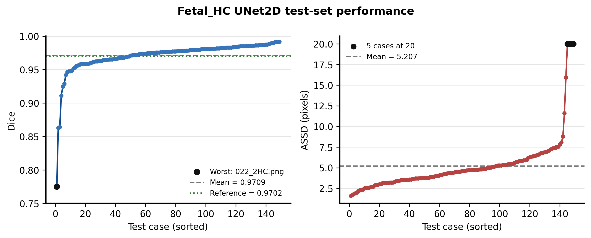
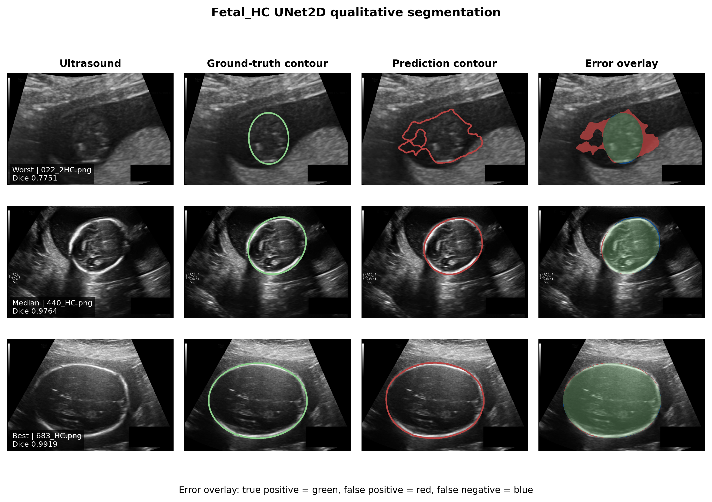

# Fetal_HC UNet2D 胎儿头部分割复现

本实验复现 PyMIC `seg_full_sup/2d_fetal_hc` 的第一个基线：使用二维 UNet 从 HC18 胎儿超声图像中分割头部区域。训练、测试和评价均在 Windows 11 + NVIDIA CUDA 环境中完成。

## 实验结果

| 指标 | 结果 |
|---|---:|
| 参数量 | 1,813,218 |
| 最佳 checkpoint | iteration 9500 |
| 最佳验证 Dice | 97.4679% |
| 测试 Dice（149 例） | 97.0872% ± 2.4234% |
| 测试 ASSD（149 例） | 5.2072 ± 3.3046 pixels |
| 单例推理时间 | 0.1184 ± 0.0198 seconds |
| 训练耗时 | 约 15 分 24 秒 |

官方示例给出的参考平均 Dice 约为 97.02%。本次结果高约 0.0672 个百分点，可视为成功复现，不需要为该差异额外调参。






## 数据划分

使用 HC18 数据集官方训练部分中的 999 例二维超声图像：

- 训练集：780 例
- 验证集：70 例
- 测试集：149 例

原始数据放在仓库根目录的 `PyMIC_data/Fetal_HC`，不提交到 Git。`config/` 保存本次实际使用的数据清单。

## 环境

本次验证环境为 Python 3.10.19、PyMIC 0.5.4、PyTorch 2.10.0+cu130、torchvision 0.25.0+cu130 和 NVIDIA GeForce RTX 5060 Laptop GPU。主要依赖见 `requirements.txt`。

## 训练、测试与评价

在本目录 `experiments/fetal_hc_unet` 中执行：

```powershell
conda activate med_ai_310
pymic_train config/unet.cfg
```

归档配置已经使用最佳 checkpoint（`ckpt_mode = 1`）。PyTorch 2.6 及以上测试本机刚生成且可信的 PyMIC checkpoint 时执行：

```powershell
$env:TORCH_FORCE_NO_WEIGHTS_ONLY_LOAD='1'
pymic_test config/unet.cfg
pymic_eval_seg --cfg config/evaluation.cfg
Move-Item results/predictions/eval_*.csv results/ -Force
Remove-Item Env:TORCH_FORCE_NO_WEIGHTS_ONLY_LOAD
```

PyMIC 会把评价 CSV 写入分割预测目录，因此评价后把 `eval_dice.csv` 和 `eval_assd.csv` 移到 `results/`，供绘图脚本读取。兼容环境变量只应用于来源明确、可信的本地 checkpoint。

## 绘图

图表遵循 `figures4papers` 出版风格，同时导出 300 DPI PNG 和可编辑 PDF。默认数据目录为仓库根目录的 `PyMIC_data/Fetal_HC`：

```powershell
python scripts/plot_results.py
```

也可以显式指定本机数据路径：

```powershell
python scripts/plot_results.py --data-root D:\Hi_Lab\PyMIC_examples\PyMIC_data\Fetal_HC
```

## 文件说明

- `config/`：训练、测试、评价配置及数据划分。
- `logs/`：完整训练与测试日志。
- `results/`：逐病例 Dice、ASSD、汇总指标和 149 张预测掩膜。
- `scripts/plot_results.py`：训练曲线、指标分布和定性图的生成脚本。
- `figures/`：PNG/PDF 论文风格图。

## 结果解读与局限性

- 最差病例 `022_2HC.png` 的 Dice 为 77.51%；5 个病例的 ASSD 被报告为 20 pixels，导致 ASSD 分布明显右偏。
- 当前只运行了一个随机种子，不能据此判断不同网络间的统计显著性。
- ASSD 按示例配置以像素为单位，不代表毫米距离。
