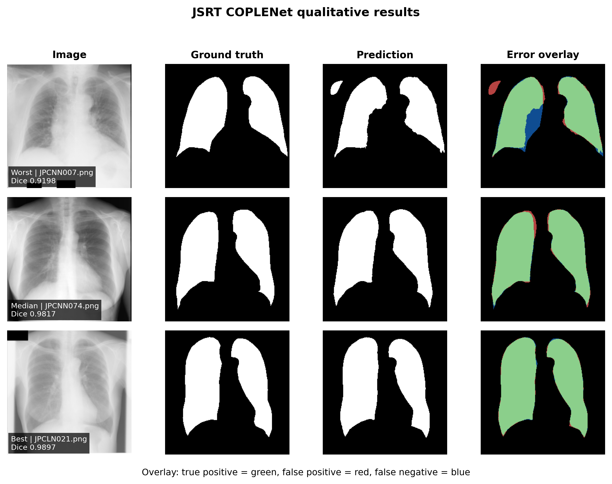

# JSRT COPLENet 肺野分割复现

本实验复现 PyMIC `seg_full_sup/2d_JSRT` 示例：使用 COPLENet 对 JSRT 胸片中的左右肺野进行二维全监督分割。训练、测试和评价均在 Windows 11 + NVIDIA CUDA 环境中完成。

## 实验结果

| 指标 | 结果 |
|---|---:|
| 最佳 checkpoint | iteration 3250 |
| 最佳验证 Dice | 97.8091% |
| 测试 Dice（47 例） | 98.0033% ± 1.0086% |
| 测试 ASSD（47 例） | 0.9593 ± 0.7154 pixels |
| 训练耗时 | 约 4 分 34 秒 |

PyMIC 示例给出的参考 Dice 约为 98.04%。本次结果相差约 -0.0367 个百分点，可视为成功复现，当前没有必要为了这一微小差异专门调参。




## 数据划分

数据放在仓库根目录的 `PyMIC_data/JSRT`：

- 训练集：180 例
- 验证集：20 例
- 测试集：47 例
- 总计：247 例

原始图像和标注不提交到 Git。`config/` 中保存了本次使用的 CSV 清单。

## 环境

本次验证环境为 Python 3.10.19、PyMIC 0.5.4、PyTorch 2.10.0+cu130、torchvision 0.25.0+cu130 和 NVIDIA GeForce RTX 5060 Laptop GPU。主要依赖版本见 `requirements.txt`。

```powershell
conda activate med_ai_310
python -c "import torch; print(torch.__version__); print(torch.cuda.is_available()); print(torch.cuda.get_device_name(0))"
```

## 训练、测试与评价

在本目录 `experiments/jsrt_coplenet` 中执行：

```powershell
pymic_train config/coplenet.cfg
```

PyTorch 2.6 及以上版本把 `torch.load` 的 `weights_only` 默认值改为 `True`。PyMIC 0.5.4 保存的 checkpoint 含有 NumPy 标量，因此本次测试本机刚生成且可信的 checkpoint 时，显式关闭该默认限制：

```powershell
$env:TORCH_FORCE_NO_WEIGHTS_ONLY_LOAD='1'
pymic_test config/coplenet.cfg
pymic_eval_seg --cfg config/evaluation.cfg
Remove-Item Env:TORCH_FORCE_NO_WEIGHTS_ONLY_LOAD
```

该环境变量会允许反序列化 checkpoint 中的普通 Python 对象，只应对来源明确、可信的本地 checkpoint 使用，不应对未知下载文件使用。

配置中的 checkpoint 目录是 `model/coplenet`，预测结果输出到 `results/predictions`。checkpoint 体积较大且可由训练重新生成，因此通过 `.gitignore` 排除。

## 重新绘图

图表遵循 `figures4papers` 风格，保存 300 DPI PNG 和可编辑 PDF。若数据位于默认的 `PyMIC_data/JSRT`，直接运行：

```powershell
python scripts/plot_results.py
```

也可以传入其他数据路径：

```powershell
python scripts/plot_results.py --data-root D:\Hi_Lab\PyMIC_examples\PyMIC_data\JSRT
```

## 文件说明

- `config/`：训练、测试、评价配置及数据划分清单。
- `logs/`：完整训练与测试日志。
- `results/`：逐病例 Dice、ASSD、汇总指标及预测掩膜。
- `scripts/plot_results.py`：指标分布和定性结果绘图脚本。
- `figures/`：论文风格 PNG/PDF 图。

## 局限性

- 当前只运行了一个随机种子，没有报告多次训练的方差。
- ASSD 按示例配置以像素为单位计算，不代表毫米距离。
- 定性图的 worst、median、best 病例按测试 Dice 自动选择。
