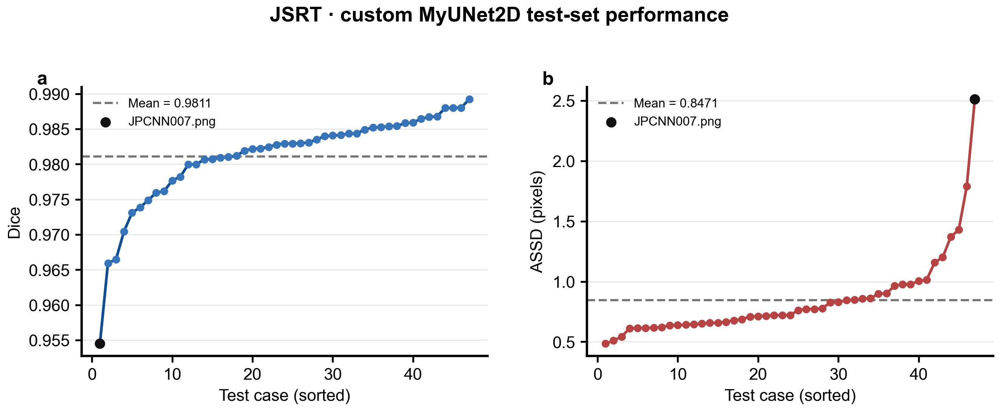
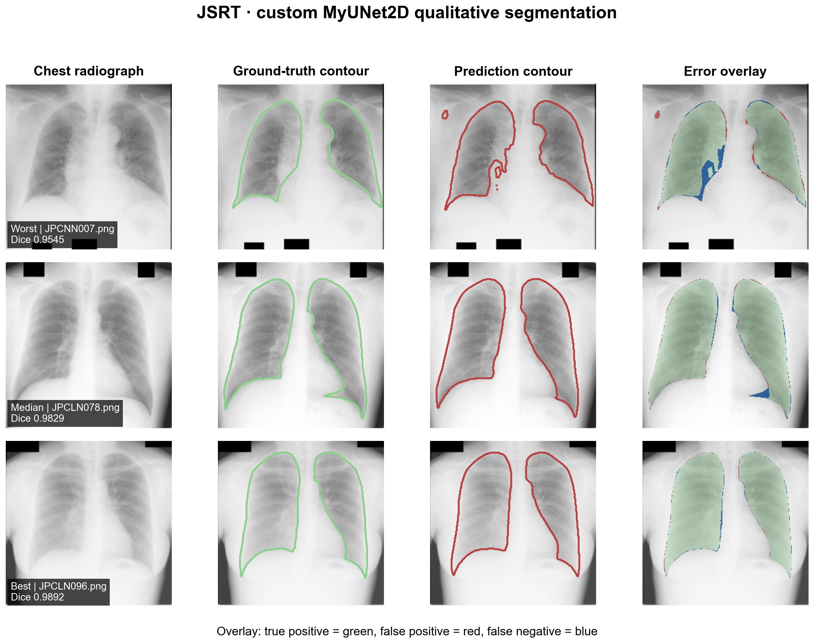

# JSRT 自定义网络与损失函数复现

本实验对应 PyMIC 示例列表中的 JSRT2 / `seg_full_sup/custom`。它沿用与 COPLENet 实验完全相同的 JSRT 数据划分，但通过 `SegmentationAgent` 注入自定义的残差二维 UNet（`MyUNet2D`）与自定义 Focal Dice loss，并联合 Cross Entropy loss 训练。

## 技术简介

MyUNet2D 保留 UNet 的编码器—解码器和跳跃连接，并在卷积块中加入残差路径，使梯度更容易传播，同时融合浅层定位信息与深层语义信息。自定义组件通过 PyMIC 的网络和损失函数字典注册，因此训练、测试和评价流程仍可复用框架原有的 agent。

Focal Dice loss 更强调难分像素和重叠质量，Cross Entropy loss 提供逐像素分类监督。两种目标相加，可以同时约束区域整体形状与局部分类错误。

## 实验结果

| 指标 | 结果 |
|---|---:|
| 参数量 | 1,944,034 |
| 最佳 checkpoint | iteration 3250 |
| 最佳验证 Dice | 97.8586% |
| 测试 Dice（47 例） | 98.1079% ± 0.6529% |
| 测试 ASSD（47 例） | 0.8471 ± 0.3484 pixels |
| 训练耗时 | 约 3 分 23 秒 |

官方示例给出的参考值约为 Dice 97.95%、ASSD 1.04 pixels。本次 Dice 高 0.1579 个百分点，ASSD 低 0.1929 pixels，复现成功且无需额外调参。





## 与 COPLENet 的配对比较

两个实验使用相同的 47 个测试病例，因此可以逐病例直接比较。自定义模型的平均 Dice 比 COPLENet 高约 0.1046 个百分点，平均 ASSD 低约 0.1123 pixels。该比较只有单次训练结果，不等同于多随机种子统计显著性结论。


## 数据与环境

数据放在仓库根目录的 `PyMIC_data/JSRT`，划分为训练 180 例、验证 20 例、测试 47 例。数据集不提交到 Git。

本次验证环境为 Windows 11、Python 3.10.19、PyMIC 0.5.4、PyTorch 2.10.0+cu130、torchvision 0.25.0+cu130 和 NVIDIA GeForce RTX 5060 Laptop GPU。

## 自定义组件

- `src/my_net2d.py`：在二维 UNet 编码器和解码器中使用残差连接的 `MyUNet2D`。
- `src/my_loss.py`：自定义 `MyFocalDiceLoss`，本次 `beta = 1.5`。
- `src/custom_run.py`：向 PyMIC `SegmentationAgent` 注册自定义网络和 loss dictionary。
- 训练目标：`MyFocalDiceLoss + CrossEntropyLoss`，权重均为 1.0。

## 训练、测试与评价

在本目录 `experiments/jsrt_custom` 中执行：

```powershell
conda activate med_ai_310
python src/custom_run.py train config/mynet.cfg
```

PyTorch 2.6 及以上把 `torch.load` 的 `weights_only` 默认值改为 `True`。测试本机刚生成且可信的 PyMIC checkpoint 时执行：

```powershell
$env:TORCH_FORCE_NO_WEIGHTS_ONLY_LOAD='1'
python src/custom_run.py test config/mynet.cfg
pymic_eval_seg --cfg config/evaluation.cfg
Move-Item results/predictions/eval_*.csv results/ -Force
Remove-Item Env:TORCH_FORCE_NO_WEIGHTS_ONLY_LOAD
```

PyMIC 默认把评价 CSV 写入分割预测目录，因此评价后将两个 CSV 移到 `results/`，让绘图脚本读取最新结果。该环境变量只应用于来源明确、可信的本地 checkpoint，不应用于未知下载文件。checkpoint 输出到 `model/mynet`，预测保存至 `results/predictions`；checkpoint 可重新训练得到，因此不提交到 Git。

## 重新绘图

图表按 `figures4papers` 风格输出 300 DPI PNG 和可编辑 PDF。默认数据目录为仓库根目录的 `PyMIC_data/JSRT`：

```powershell
python scripts/plot_results.py
```

也可以显式指定当前数据路径：

```powershell
python scripts/plot_results.py --data-root D:\Hi_Lab\PyMIC_examples\PyMIC_data\JSRT
```

## 文件说明

- `config/`：训练、测试、评价配置及数据划分清单。
- `src/`：示例使用的自定义网络、loss 和运行入口。
- `logs/`：完整训练和测试日志。
- `results/`：逐病例 Dice、ASSD、汇总指标和 47 张预测掩膜。
- `scripts/plot_results.py`：指标分布、定性结果和模型对比绘图脚本。
- `figures/`：PNG/PDF 论文风格图。

## 局限性

- 每个模型只运行一次，尚无多随机种子均值、方差或显著性检验。
- ASSD 按示例配置以像素为单位计算，不代表毫米距离。
- best、median、worst 定性病例按本模型测试 Dice 自动选择。
