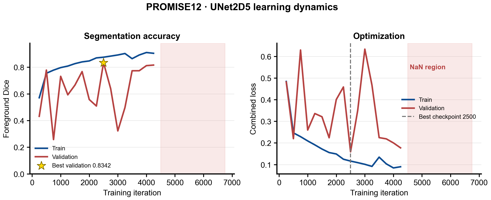
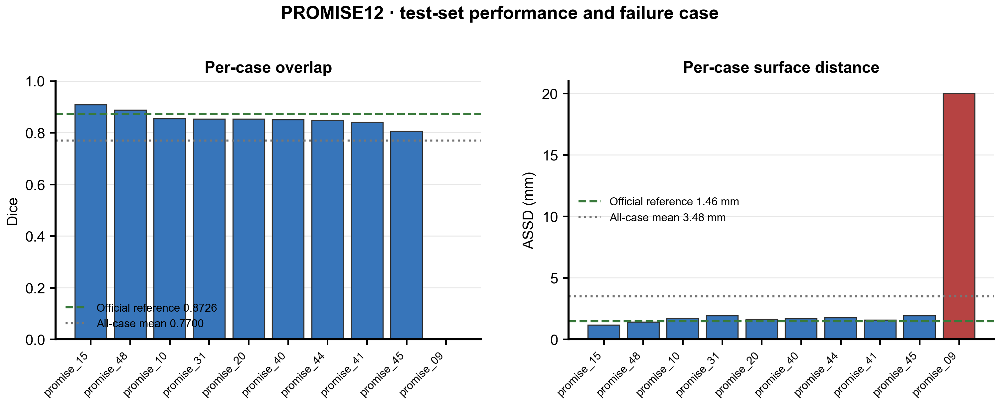
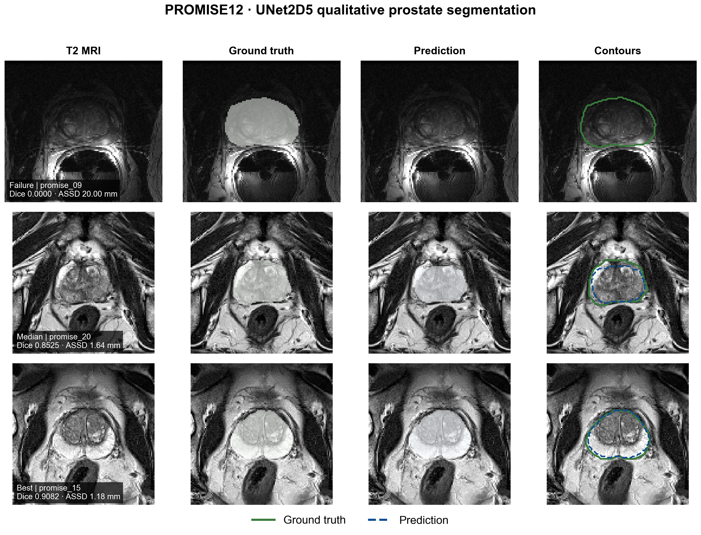

# PROMISE12 UNet2D5 前列腺 MRI 分割复现

本实验复现 PyMIC `seg_full_sup/3d_prostate` 示例，使用 UNet2D5 在 PROMISE12 三维 T2 MRI 上分割前列腺。UNet2D5 在浅层采用二维卷积提取切片内纹理，在深层采用三维卷积融合层间信息，是计算成本与三维上下文之间的折中。

## 实验结果

| 指标 | 本次结果 |
|---|---:|
| 参数量 | 20,957,530 |
| 最佳 checkpoint | iteration 2500 |
| 最佳验证 Dice | 83.4227% |
| 测试 Dice（全部 10 例） | 76.9984% ± 25.7951% |
| 测试 ASSD（全部 10 例） | 3.4817 ± 5.5102 mm |
| Dice（排除失败病例的敏感性分析） | 85.5537% |
| ASSD（排除失败病例的敏感性分析） | 1.6464 mm |

官方示例参考值为 Dice 87.26%、ASSD 1.46 mm。完整测试均值被 `promise_09` 显著拉低：该病例的预测为全背景，Dice 接近 0、ASSD 为评价上限 20 mm。其余 9 例的结果接近参考值；敏感性分析仅用于解释均值，不替代完整 10 例结果。







## 数据与配置

- 数据：PROMISE12 预处理三维 MRI，共 50 例。
- 划分：训练 35 例、验证 5 例、测试 10 例；官方脚本固定随机种子 2019。
- patch：64 × 128 × 128。
- 网络：UNet2D5，特征通道 `[32, 64, 128, 256, 512]`，深监督与多尺度预测。
- 损失：Dice loss + cross-entropy loss。
- 优化器：Adam，初始学习率 0.001，PolynomialLR。
- 本机显存为 8 GB，batch size 2 会触发严重显存换页，因此最终使用 batch size 1，并把最大训练长度扩展到 16000 iterations。

训练在 iteration 2500 达到最佳验证 Dice。从 iteration 4500 开始出现 NaN，最终在 iteration 6750 早停；测试明确使用 `ckpt_mode = 1` 加载 iteration 2500 的最佳 checkpoint。归档前已验证该 checkpoint 的全部参数为有限值。

## Windows 兼容处理

PyMIC 0.5.0 的测试后处理会把带标签 CSV 的两列误当成两个 batch 元素。推理使用仅包含 `image` 列的 `image_test_input.csv`，评价仍通过 `image_test_gt_seg.csv` 与完整标签配对。

此外，PyMIC 的 Windows 配置副本逻辑只正确处理不含目录分隔符的配置参数，因此训练和测试从示例根目录直接传入 `unet2d5_bs1_long.cfg`。

## 复现命令

```powershell
conda activate med_ai_310
cd D:\Hi_Lab\PyMIC_examples\seg_full_sup\3d_prostate
pymic_train unet2d5_bs1_long.cfg

$env:TORCH_FORCE_NO_WEIGHTS_ONLY_LOAD="1"
pymic_test unet2d5_bs1_long.cfg
pymic_eval_seg --cfg config/evaluation_unet2d5_bs1_long.cfg
```

`TORCH_FORCE_NO_WEIGHTS_ONLY_LOAD` 只用于本机生成且来源可信的 checkpoint。

## 重新绘图

```powershell
python scripts/plot_results.py --data-root D:\Hi_Lab\PyMIC_examples\PyMIC_data\Promise12\preprocess
```

脚本输出 300 DPI PNG 和矢量 PDF，采用 figures4papers 风格。

## 文件说明

- `config/`：最终训练、测试、评价配置及数据划分。
- `logs/`：最终训练、测试和评价日志。
- `results/`：逐病例 Dice/ASSD 和 10 个预测分割体积。
- `scripts/plot_results.py`：学习曲线、逐病例指标和定性结果绘图。
- `figures/`：PNG/PDF 论文风格图。

原始数据和约 240 MB 的 checkpoint 不提交到 Git。

## 局限性

- 只运行一个随机种子，不能用于统计显著性比较。
- batch size 与官方默认值不同，优化轨迹不可完全等同。
- `promise_09` 是稳定失败病例；进一步判断采集域差异或模型不确定性需要独立消融实验。
